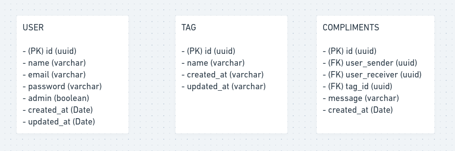
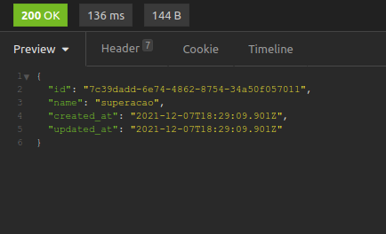
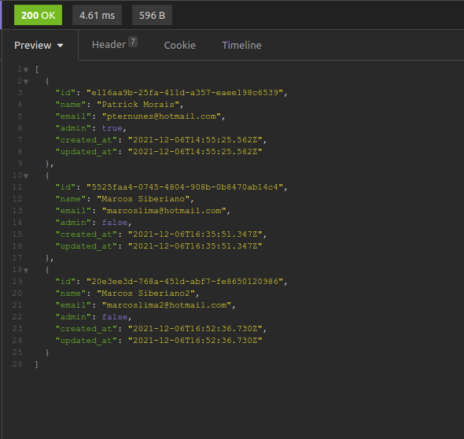
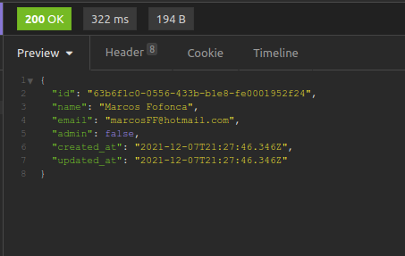

<br />

# :pushpin: Índice
- [Banco de Dados](#package-banco-de-dados)
- [Regras da Aplicação](#scroll-regras-da-aplicação)
- [Rotas](#mailbox_closed-Rotas)
- [Mídia](#camera_flash-mídia)
- [Sobre](#monocle_face-sobre)
- [Tecnologias](#rocket-tecnologias)
- [Instalação](#hammer_and_wrench-instalação)
- [Autor](#closed_book-autor)
<br />

---

# :package: Banco de Dados

O Banco de dados utilizado foi o PostgreSQL com TypeORM.
Para monitoramento foi utilizado o Beekeeper.

A estrutura dos dados ficou desenhada dessa forma:



---

# :scroll: Regras da Aplicação

- ### Cadastro de Usuário
  - Não é permitido cadastrar mais de um usuário com o mesmo email.
  - Não é permitido cadastrar um usuário sem email.

- ### Cadastro de Tags
  - Não é permitido cadastrar mais de uma tag com o mesmo nome.
  - Não é permitido cadastrar uma tag sem nome.
  - Não é permitido o cadastro de uma tag por usuários que não sejam administradores.
  - O usuário precisa estar autenticado na aplicação.

- ### Cadastro de Elogios
  - Não é permitido um usuário cadastrar um elogio para si.
  - Não é permitido um usuário cadastrar um elogio para usuário inválidos.
  - O usuário precisa estar autenticado na aplicação.

---

# :mailbox_closed: Rotas

  - ### Post
    `/users` Registra um novo usuário. <br><br>
    `/tags` Registra uma nova tag (Precisa ser administrador. <br><br>
    `/login` Loga na aplicação e gera um token JWT. <br><br>
    `/compliments` Registra um novo elogio para um usuário. (Precisa estar autenticado.)<br><br>

  - ### Get
    `/users/compliments/send` Lista elogios que o usuário logado enviou (Precisa estar autenticado).<br><br>
    `/users/compliments/received` Lista elogios que o usuário logado recebeu (Precisa estar autenticado).<br><br>
    `/tags` Lista todas as tags (Precisa estar autenticado).<br><br>
    `/users` Lista todos os usuários (Precisa estar autenticado).<br><br>

---

# :camera_flash: Mídia

Aqui alguns exemplos de respostas das requisições que podem ser feitas: <br>

- Criar uma tag <br>


- Listar todos os usuários <br>
***OBS*** _Nessa resposta da requisição foi utilizado o decorator Exclude() da biblioteca `class-transformer` para retirar o campo `password` da resposta. Legal né!?_ <br>


- Criar um usuário <br>
***OBS*** _O campo `id` foi gerado pela biblioteca `uuid` usando o tipo de hash aleatória `v4`_ <br>


---

# :monocle_face: Sobre
Esse projeto foi feito com a intenção de praticar Node utilizando Typescript com PostgreSQL e TypeORM.

Para tratar a senha recebida na criação de um usuário, foi utilizado a biblioteca `bcryptjs`.

Um middleware para confirmar se o usuário logado é administrador foi criado. <br><br>
A verificação do token JWT também é feita pelo middleware, sendo o `id` do usuário logado resgatado do próprio payload do token.

Espero que tenha gostado :)
<br />

---

# :rocket: Tecnologias
Esse projeto foi feito utilizando as seguintes tecnologias: <br>
- :heavy_check_mark: **Node**
- :heavy_check_mark: **Express**
- :heavy_check_mark: **Typescript**
- :heavy_check_mark: **TypeORM**
- :heavy_check_mark: **PostgreSQL**
- :heavy_check_mark: **JWT Auth**
- :heavy_check_mark: **bcryptjs / class-transformer**
- :heavy_check_mark: **ESLint**
- :heavy_check_mark: **Prettier**
<br><br>
<br />

---

# :hammer_and_wrench: Instalação
**Esse projeto envolve variáveis ambientes, tenha certeza de que você as possui antes de tentar executar!**

1. Clone o repositório

```bash
git clone git@github.com:PatrickMoraisN/valoriza-server.git
```

2. Mude para o diretório do repositório

```bash
cd valoriza-server
```

3. Instale as dependências

```bash
npm install
```

4. Crie um arquivo `.env` na raíz do seu projeto e adicione as variáveis ambientes

***OBS*** Necessário ter instalado o PostgreSQL na máquina!

```bash
### JWT
JWT_SECRET=b09879245dc798a8f22f44d77f78861fae9e39b9

### PostgreSQL
POSTGRE_USER=seu-usuario-postgre
POSTGRE_PASS=sua-senha-postgre
POSTGRE_DATABASE=nome-do-seu-banco-de-dados
POSTGRE_PORT=porta-do-banco-de-dados

```

5. Rode as Migrations

```bash
npx -p typeorm ts-node-dev ./node_modules/typeorm/cli.js migration:run
```

6. Inicie o app

```bash
npm run dev
```

Tá tudo pronto! O servidor está online em [localhost:3000](http://localhost:3000/)!

---

# :closed_book: Autor
Patrick Morais <br>
[](https://www.linkedin.com/in/patrick-morais/)<br>
[](mailto:ppternunes@gmail.com)<br>
[](https://www.github.com/patrickmoraisn/)
